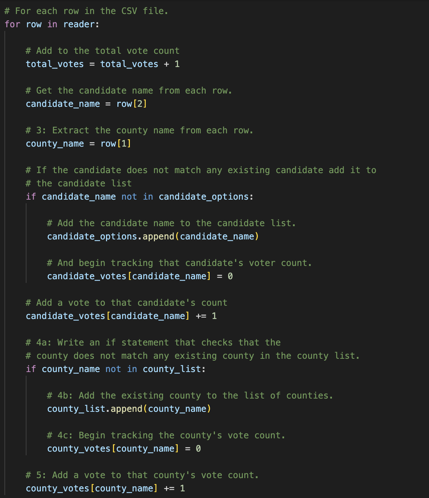
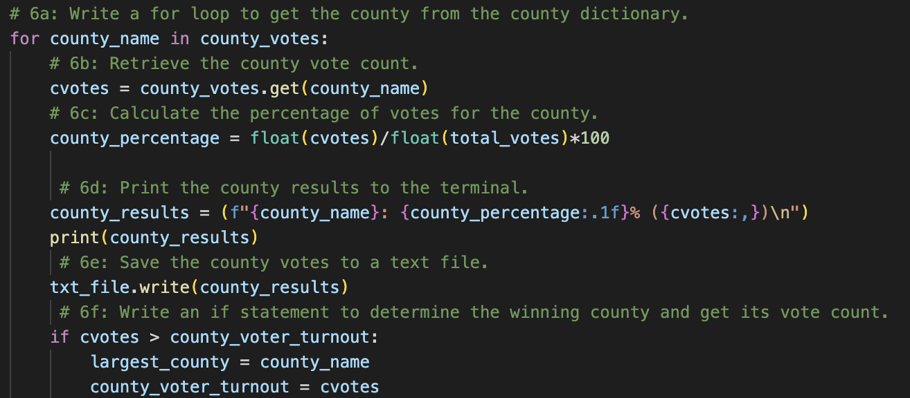
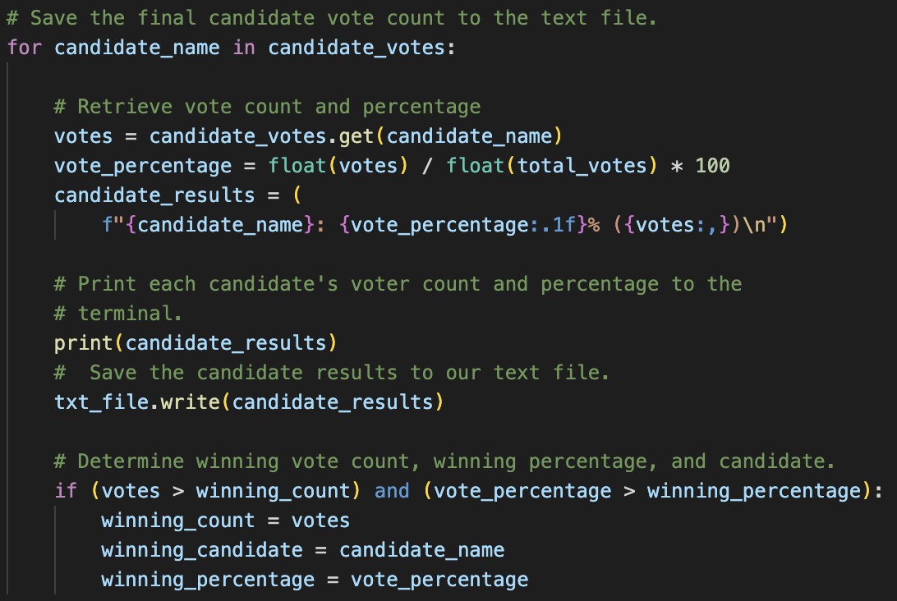

# Election-Analysis

## Overview
The project we have been asked to partake in has us auditing and parsing election results to determine the popular vote winner, determining what county voted the most, as well as the totals and percentages for each candidate and county.  While this could've been achieved in Excel we were asked to implement this analysis in a more accessible, dynamic, and easily repeatable format.  Because of this last part it was determined we needed to be able to perform this analysis using python in tandem with github.  This would mean the the code that we write could output our analysis and if we wanted to change which counties, which election race we were looking at, or the size of the file we were concerned with the only change we would need to do is make sure the correct comma seperated (csv) file was saved to the correct location in our repository.  Versus if we had used excel it would be a more difficult process to replicate and would involve more copying and pasting of the csv data.

## Audit Results
The Results for this election audit can be found in the election_analysis.txt file in the Analysis folder.  Additionally the code to determine the count totals (Figure 1), county with the largest vote count (Figure 2), and winning candidate (Figure 3) can be found below.  To give a summary:
- There were a total of 369,711 votes cast as a part of this Audit
- The County with the most votes was Denver County
    - Jefferson County contributed 10.5% of the votes for a total of 38,855 votes
    - Denver County contributed 82.8% of the votes for a total of 306,055 votes
    - Arapahoe contributed 6.7% of the votes for a total of 24,801 votes
- Diana DeGette was the winner of the election based on popular vote
    - Charles Casper Stockham received 23% of the vote with 85,213 votes
    - Diana DeGette received 73.8% of the vote with 272,892 votes
    - Raymon Anthony Doane received 3.1% of the vote with 11,606 votes

#### Figure 1: Python Loop to Count Votes

#### Figure 2: Python Loop to Determine the Largest County Votes

#### Figure 3: Python Loop to Determing the Winning Candidate

As was stated above, the county that had the most votes was Denver County with 82.8% of all votes for a total of 306,055 votes.  The winner of the election was Diana DeGette with 73.8% of the vote for a total of 272,892 votes.

## Audit Summary
The Code associated with this project works pretty well in this type of election but, with modification, could be used for elections other than simple statewide Popular Vote Elections.  The two examples that jump to mind would be an election for the United States House of representatives where the data might look similar to our current csv file however there would be an additional column for what district the representative is seeking a seat.  The only change required would be that we needed to sum up the totals for each district which should only require some additional  variables to store data simmilar to how we have our candidate name list and candidate votes dictionary.  Similarly this code could be applied to something more complicated such as the Presidential Elections.  The main modification that would need to happen would be variables to store how many Electoral College Votes there are for each state along with the rules to determine how those electoral college votes are distributed.  From there it would require finding the popular winners in each state and dividing up the electoral college votes according to the rules we stored previously and declaring a winner based off of the electoral college vote totals.
